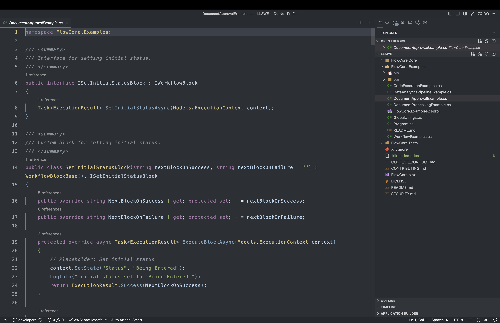
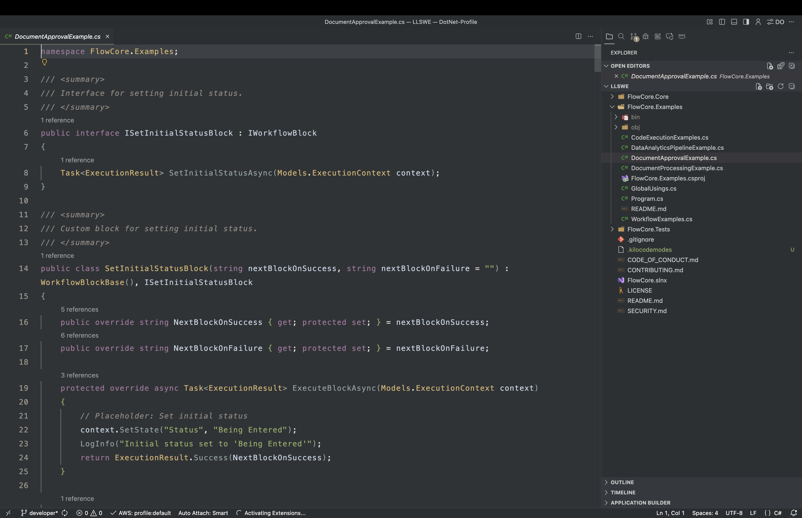
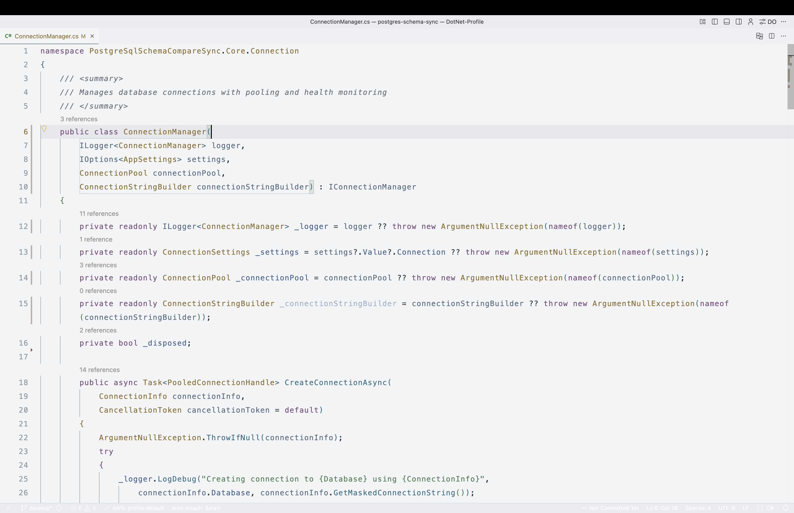

# Relaxed Theme – Semantic Focus

A calm, readable dark theme for Visual Studio Code with first‑class semantic highlighting. Tuned for TypeScript/JavaScript, C# (.NET) with clear differentiation of keywords, functions, parameters, properties, and types. Includes thoughtful UI polish for search, peek, brackets, inlay hints, breadcrumbs, tabs, and minimap.

- Consistent accent color and accessible contrast
- Rich semantic token colors for TS/JS/JSX/TSX, C#
- Works great on macOS and Windows
- Git decorations and diff colors for quick code scanning

## Features

- Language semantics
  - Strong separation of functions/methods, parameters, properties/fields, classes/types/interfaces, enums and members
  - Semantic token support: namespaces, modules, readonly, static, default library, decorators/attributes, etc.
- UI polish
  - Find/Replace and Peek highlights
  - Hover and linked editing highlights
  - Bracket pair colors and vertical guides
  - Inlay hints styled to be helpful yet subtle
  - Breadcrumbs and Sticky Scroll theming
  - Minimap, folding, and selection improvements
- Git and diffs
  - Clear added/modified/removed gutter and minimap signals
  - Git decorations tuned to the palette

## Color palette

| Role | Color |
|---|---|
| Background | `#2e333b` |
| Foreground (text) | `#e0e0e0` |
| Accent (links, focus, borders) | `#6a8799` |
| String / Inserted | `#97af5d` |
| Keyword / Macro | `#b06698` |
| Number / Enum member | `#ecd3a8` |
| Type / Class / Interface | `#e7c380` |
| Property / Member | `#c9dfff` |
| Error / Deleted | `#d1635e` |

## Enable semantic highlighting
- Settings → “Editor: Semantic Highlighting” → On
- Ensure language extensions are installed and updated:
  - TypeScript/JavaScript (built-in)
  - C# ([C# Dev Kit or ms-dotnettools.csharp](https://marketplace.visualstudio.com/items?itemName=ms-dotnettools.csharp))

## Recommended settings (cross‑platform)

These work on macOS and Windows by prioritizing available fonts on each OS.

```json
{
  "workbench.colorTheme": "Relaxed Theme - Semantic Focus",
  "editor.semanticHighlighting.enabled": true,
  "editor.fontFamily": "SF Mono, 'Cascadia Code', JetBrains Mono, Menlo, Monaco, Consolas, 'Courier New', monospace",
  "editor.fontLigatures": true,
  "editor.fontVariations": true,
  "editor.fontWeight": "500",
  "editor.fontSize": 14,
  "editor.cursorBlinking": "smooth",
  "editor.cursorSmoothCaretAnimation": "on",
  "editor.smoothScrolling": true,
  "editor.renderWhitespace": "boundary",
  "editor.guides.bracketPairs": true,
  "editor.guides.bracketPairsHorizontal": true
}
```
## Language coverage (highlights)

- TypeScript / JavaScript / JSX / TSX
  - Functions/methods, parameters, properties, classes, interfaces, enums, decorators, type annotations
- C# (.NET)
  - Methods, parameters, classes/structs/interfaces/enums, attributes, namespaces, keywords
## Screenshots
Place your screenshots in `images/` and reference them here:
- Editor (TypeScript)
- Editor (C#)
- Search/Peek/Bracket Guides

Example:
**Dark Focus**


**Night Warm**


**Day Light**


## Credits

This extension is inspired by and builds upon the original Relaxed Theme. Many thanks to the [Relaxed](https://marketplace.visualstudio.com/items?itemName=mischah.relaxed-theme) Theme authors and contributors for the foundational palette and design ideas.

If you maintain or know the canonical link for the Relaxed Theme you’d like credited, feel free to open a PR to add it here.

## Contributing

- Open issues and PRs with before/after screenshots where possible.
- Keep contrast at or above WCAG AA (4.5:1) for critical UI.
- Maintain the core palette; introduce new colors sparingly.
- Test across macOS and Windows, and with TS/JS, C# files.

## License

See [LICENSE](./LICENSE).
---
Enjoy coding with a calm, consistent, and semantic‑rich theme.
